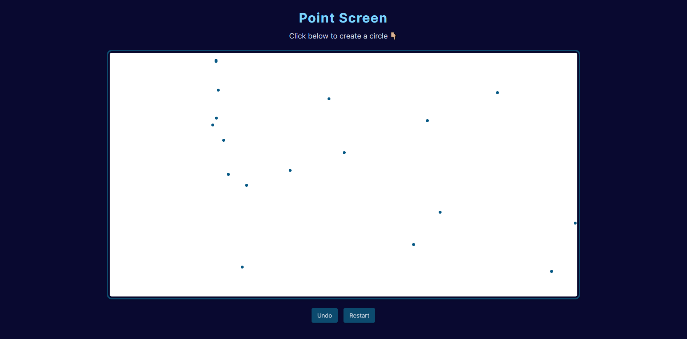

  
  
  
  

# 💻 Point Screen

Utilizar React e Material UI para criar um formulário ficticio para cadastro de cliente com os campos: Nome, CPF, E-mail, Cep, Endereço, Número do endereço, Bairro, Cidade. Abaixo dos campos um botão "SALVAR" que mostra as informações no console do navegador.

## 🚀 Tecnologias

- [ReactJS](https://reactjs.org/)
- [TypeScript](https://www.typescriptlang.org/)
- [TailwindCSS](https://tailwindcss.com/)

## 📑 Features

- Printar no quadro branco uma bolinha de acordo com o que o usuário for clicando.

## 💡 Desafios

- Criar layout utilizando TailwindCSS; ✔️
- Criar um quadro onde que quando o usuário clicar irá criar uma bolinha sinalizando qual lugar ele clicou; ✔️
- Criar botão para desfazer o último registro; ✔️
- Criar botão para começar do zero; ✔️
- Refatorar o código passando useContext e componentizando o projeto; ✔️
- A cor da bolinha ser aleatória; ⏳

## 🖼️ Previews

| Point Screen                                   |
| ---------------------------------------------- |
|  |
