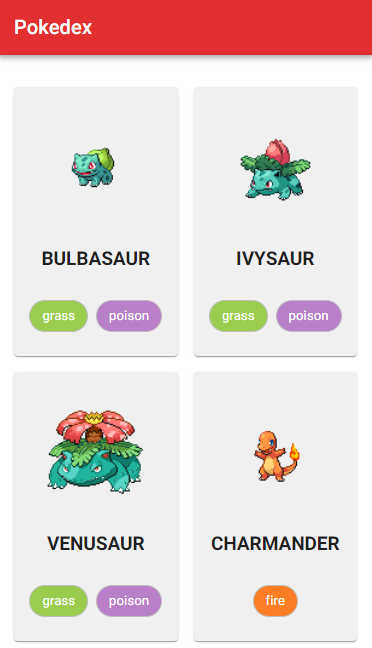

  
  
  
  
  

# 💻 Pokedex

Fazer uma busca em uma Api para visualizar os dados do Pokémon em forma de uma Pokedex com as seguintes informações. A tela inicial deve ter um card para cada Pokémon com seu nome, tipo e a imagem, depois ser possível clicar e levar pra outra página com mais detalhes do Pokémon selecionado.

## 🚀 Tecnologias

- [ReactJS](https://reactjs.org/)
- [TypeScript](https://www.typescriptlang.org/)
- [MUICore](https://mui.com/core/)
- [StyledComponents](https://styled-components.com/)
- [ReactRouterDom](https://reactrouter.com/en/6.4.4)
- [Axios](https://www.npmjs.com/package/axios)
- [PokeApi](https://pokeapi.co/)

## 📑 Features

- Criar uma Pokedex com a [PokeApi](https://pokeapi.co/).

## 💡 Desafios

- Criar layout utilizando MUI e Styled Components; ✔️
- Buscar as informações do Pokémon na API utilizando Axios; ✔️
- Listar os Pokemon na tela inicial com: Nome, Tipo e Imagem; ✔️
- Criar uma rota que quando selecionar o card na Pokedex ir nos detalhes do Pokémon selecionado; ✔️
- Listas as informações de: Nome, Tipo, Imagem, Peso, Altura e Habilidades; ✔️

## 🖼️ Previews

| Pokedex - WEB                                 |
| --------------------------------------------- |
|  |

| Pokedex - Mobile                                 |
| ------------------------------------------------ |
|  |
